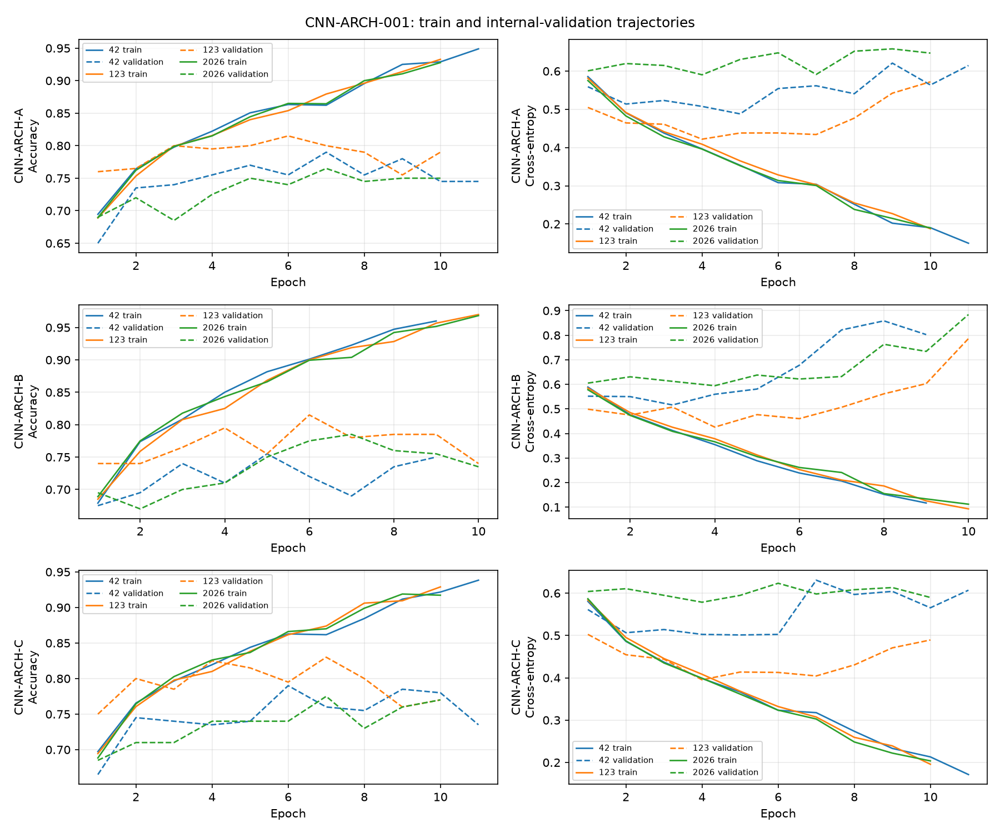

# CNN 架构选择：CNN-ARCH-001

仅使用 `data/train` 的种子 42、123、2026 三份既有 1800/200 划分；输入固定为 Stage I 的 `REP-006-FUSION`，`[190,7,7]` 保留空间结构。归一化逐划分仅由 1800 张训练图拟合。没有使用 `data/val`。

三个模型均使用 Conv→BatchNorm→ReLU、全局平均池化和两类原始 logits。A 为 1×1 投影与两层 3×3 卷积；B 为 1×1 投影、两个 64 通道残差块、1×1 升维；C 为 1×1 投影、1×1/3×3/膨胀 3×3 三分支拼接、1×1 升维。均无中途下采样或 Dropout。

固定训练协议：CrossEntropyLoss、AdamW、学习率 `3e-4`、权重衰减 `1e-4`、批量 32、最多 30 轮、验证损失早停耐心 6；检查点按最高内部验证准确率、同分较低验证损失选择。

## 三架构比较

标准差为三个种子的样本标准差。

| 架构 | 参数量 | 验证准确率（均值 ± 标准差） | 最差种子 | 猫/狗均值 | 平衡准确率 | Macro F1 | 最佳轮次中位数 | 平均训练秒数 |
|---|---:|---:|---:|---:|---:|---:|---:|---:|
| CNN-ARCH-A | 123,522 | 79.00% ± 2.50% | 76.50% | 85.33%/72.67% | 79.00% | 78.85% | 7 | 5.65 |
| CNN-ARCH-B | 168,962 | 78.50% ± 3.00% | 75.50% | 85.00%/72.00% | 78.50% | 78.33% | 6 | 6.96 |
| CNN-ARCH-C | 89,794 | 79.83% ± 2.84% | 77.50% | 84.33%/75.33% | 79.83% | 79.78% | 7 | 12.92 |

三个种子的逐次验证准确率：CNN-ARCH-A = 42: 79.00%, 123: 81.50%, 2026: 76.50%；CNN-ARCH-B = 42: 75.50%, 123: 81.50%, 2026: 78.50%；CNN-ARCH-C = 42: 79.00%, 123: 83.00%, 2026: 77.50%

## 逐次曲线与拟合行为

训练准确率是含 BatchNorm 的逐批训练过程统计；验证指标来自 `eval()`。最佳轮后的验证损失变化只在实际观察到后续轮次时计算。

| 架构 | 种子 | 最佳轮/末轮 | 最佳轮训练/验证准确率 | 末轮训练/验证准确率 | 最佳轮→末轮验证损失 | 曲线迹象 |
|---|---:|---:|---:|---:|---:|---|
| CNN-ARCH-A | 42 | 7/11 | 86.22%/79.00% | 94.89%/74.50% | 0.5616→0.6146 (+0.0530) | 有后续轮次，未达到上述明显恶化判据 |
| CNN-ARCH-A | 123 | 6/10 | 85.39%/81.50% | 93.28%/79.00% | 0.4382→0.5720 (+0.1338) | 训练继续提升而验证损失明显上升 |
| CNN-ARCH-A | 2026 | 7/10 | 86.44%/76.50% | 92.78%/75.00% | 0.5914→0.6471 (+0.0557) | 有后续轮次，未达到上述明显恶化判据 |
| CNN-ARCH-B | 42 | 5/9 | 88.17%/75.50% | 96.00%/75.00% | 0.5809→0.8026 (+0.2217) | 训练继续提升而验证损失明显上升 |
| CNN-ARCH-B | 123 | 6/10 | 90.00%/81.50% | 97.00%/74.00% | 0.4603→0.7864 (+0.3261) | 训练继续提升而验证损失明显上升 |
| CNN-ARCH-B | 2026 | 7/10 | 90.39%/78.50% | 96.83%/73.50% | 0.6318→0.8842 (+0.2524) | 训练继续提升而验证损失明显上升 |
| CNN-ARCH-C | 42 | 6/11 | 86.28%/79.00% | 93.83%/73.50% | 0.5025→0.6070 (+0.1045) | 训练继续提升而验证损失明显上升 |
| CNN-ARCH-C | 123 | 7/10 | 87.39%/83.00% | 92.89%/77.00% | 0.4043→0.4893 (+0.0850) | 有后续轮次，未达到上述明显恶化判据 |
| CNN-ARCH-C | 2026 | 7/10 | 87.00%/77.50% | 91.72%/77.00% | 0.5980→0.5898 (-0.0083) | 有后续轮次，未达到上述明显恶化判据 |

上述曲线迹象只描述已记录轮次，不把训练准确率高于验证准确率本身当作过拟合证明。

CNN-ARCH-A：猫/狗平均准确率差 12.67 个百分点，存在明显类别偏向。
CNN-ARCH-B：猫/狗平均准确率差 13.00 个百分点，存在明显类别偏向。
CNN-ARCH-C：猫/狗平均准确率差 9.00 个百分点，未达到 10 个百分点的类别偏向描述阈值。

## 固定选择与 DNN 参照

按预设规则选定 **CNN-ARCH-C**。最高均值比第二名高至少 0.75 个百分点。前两名平均准确率相差 0.83 个百分点。

已冻结的 DNN-ARCH-C 内部验证参照为 78.17% ± 1.26%。所选 CNN 均值高 1.67 个百分点；这只是内部划分的描述性差异，不参与 CNN 选择，也不代表最终测试优势。两类模型的学习率及训练协议不同。

所选架构平均训练 12.92 秒；最快的 CNN-ARCH-A 为 5.65 秒。参数量不能单独代表这组三分支卷积的实际运行耗时。

所选架构在 3/3 个种子的最后训练准确率达到至少 90%，在 2/3 个种子的最后验证准确率比此前峰值低至少 3 个百分点，在 1/3 个种子的最后验证损失比此前最低值高至少 0.10。训练端未见明显欠拟合；这些后期差距为单独评估训练策略提供依据，但本阶段不预设策略一定能提高保留集表现。

本阶段只选 CNN 架构。没有运行训练策略搜索、最终全量 CNN 训练或 `data/val` 评估。若之后需要策略优化，应另立实验编号及测试前协议。
