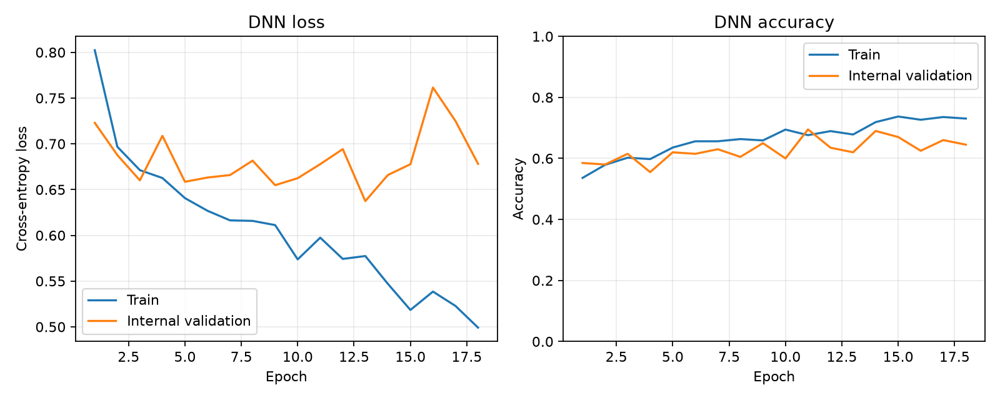
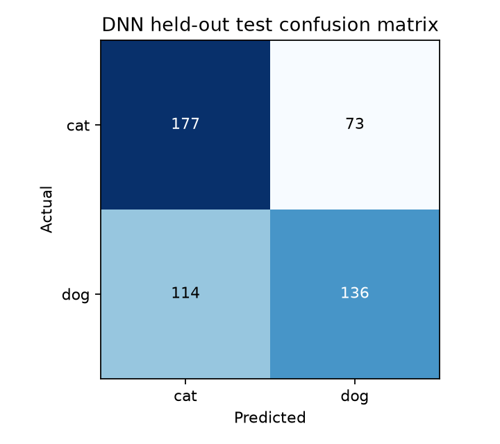
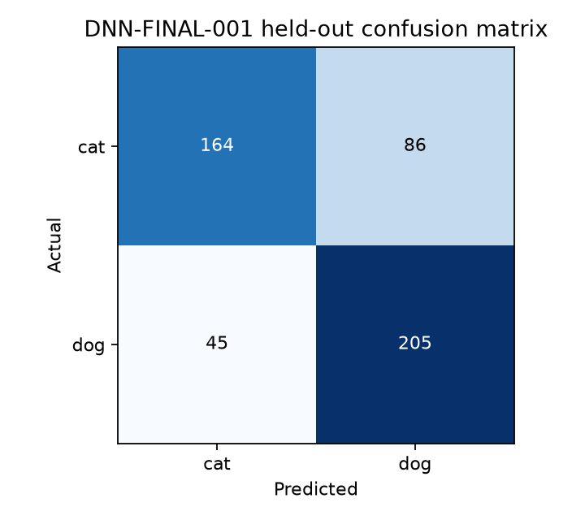
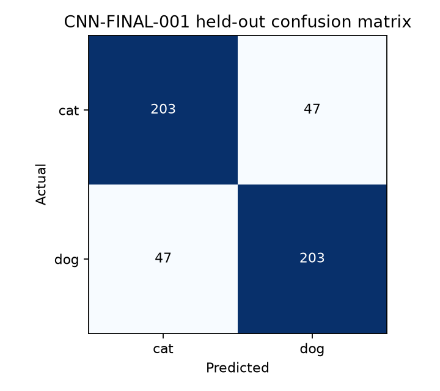

# 猫狗图像分类实验报告（持续更新）

> 截至 2026-10-02，DNN 与 CNN 最终实验、RNN 架构优化和训练策略比较已完成；RNN 最终训练与保留集评估待开展。下列数值均来自实际运行产物。

## 1. 实验目的与数据

按照作业要求，分别使用 DNN、CNN、RNN 对图像进行猫狗二分类，比较三类网络的表示方式和分类表现。数据均来自本地 `data/`：`train` 含猫、狗各 1000 张；`val` 含猫、狗各 250 张。文件名确定标签，`cat=0`、`dog=1`。全部 2500 张图像均已完整解码为 RGB，未发现解码失败。

为避免用测试集调参，从 2000 张训练图中按类别和种子 42 固定划出 1800 张训练图（各类 900 张）和 200 张内部验证图（各类 100 张）。`data/val` 的 500 张图只用于模型选择完成后的最终测试。

## 2. 统一实验设置

平台为 WSL Ubuntu 24.04、Python 3.12.3、PyTorch 2.5.1+cu121、TorchVision 0.20.1+cu121，训练设备为 NVIDIA GeForce RTX 3050 Ti Laptop GPU（4 GB 显存）。三种主实验计划共享标签映射、内部划分、评估代码、交叉熵损失和准确率定义；模型各自必要的输入尺寸差异单独注明。

采用两类原始 logits 与 `CrossEntropyLoss`。总体准确率为正确数除以样本总数；某类准确率为该类预测正确数除以该类样本数。混淆矩阵的行是真实类别，列是预测类别，顺序均为猫、狗。

## 3. DNN 主实验（DNN-001）

实验编号及提交索引见 [experiment_log.md](experiment_log.md)。

### 网络与输入

原图缩放为 64×64 RGB；转成张量后每通道用均值 0.5、标准差 0.5 归一化。训练时随机水平翻转（概率 0.5），内部验证与测试不使用随机变换。网络为：

| 层 | 输出/作用 |
|---|---|
| Flatten | 将 `3×64×64` 转为 12,288 维向量 |
| Linear + ReLU + Dropout 0.3 | 12,288 → 256 |
| Linear + ReLU + Dropout 0.3 | 256 → 64 |
| Linear | 64 → 2 个原始类别 logits |

模型共有 **3,162,562** 个可训练参数，无卷积或循环层。展平便于建立纯 DNN 基线，但不会显式保留物体的局部空间结构。

### 训练流程

使用 AdamW，学习率 `1e-3`、权重衰减 `1e-4`、批量 32、种子 42、最多 30 轮。验证损失连续 5 轮未持续改善时早停；保存内部验证准确率最高的检查点，准确率相同则取损失更低者。训练实际运行 **18 轮**，训练循环耗时 **66.53 秒**，最佳检查点来自 **第 11 轮**。该轮训练准确率为 **67.61%**；第 18 轮训练准确率达到 **73.06%**，但未带来稳定的验证收益。

### 内部验证与最终测试

| 数据 | 样本数 | 损失 | 总体准确率 | 猫准确率 | 狗准确率 |
|---|---:|---:|---:|---:|---:|
| 内部验证（最佳检查点） | 200 | 0.6778 | **69.50%** | 77.00% | 62.00% |
| 保留测试集 | 500 | 0.6730 | **62.60%** | 70.80% | 54.40% |

内部验证混淆矩阵为 `[[77, 23], [38, 62]]`。保留测试集混淆矩阵为 `[[177, 73], [114, 136]]`，即 250 张猫图中 177 张判对，250 张狗图中 136 张判对。测试总体准确率比内部验证低 **6.90 个百分点**。模型把 114 张狗图误判为猫，狗类表现尤其弱。





### 观察与局限

训练损失总体下降，但内部验证曲线波动，后期训练准确率上升没有转化为稳定的验证提升，提示模型泛化能力有限。展平图像使网络无法直接利用邻近像素和局部纹理的结构；这一解释与 DNN 的测试表现一致，但在 CNN、RNN 实验完成前，不能据此宣称另一种架构实测更好。内部验证仅 200 张，最佳轮次的准确率估计也有波动；本次没有根据保留测试集结果继续调参。

### 结果来源与复现

- 训练配置与划分：`../outputs/dnn/config.json`、`../outputs/dnn/split.json`。
- 逐轮数据与汇总：`../outputs/dnn/history.csv`、`../outputs/dnn/train_summary.json`。
- 测试指标、混淆矩阵与检查点：`../outputs/dnn/test_metrics.json`、`../outputs/dnn/best_model.pt`。

```bash
cd /mnt/e/CircuitWizard/2-NLP/hw/hw1
source ~/.venvs/hw1/bin/activate
python train.py --model dnn --data-dir data
python evaluate.py --checkpoint outputs/dnn/best_model.pt --data-dir data/val
```

## 4. CNN 最终实验（CNN-FINAL-001）

固定 `REP-006-FUSION`、CNN-ARCH-C 与 T1 水平镜像策略后，以全部 2000 张训练原图及其 2000 张镜像图拟合归一化并训练，种子 42，固定 4 轮，89,794 个可训练参数。重载末轮检查点后，对 500 张保留图的一次评估得到损失 **0.4389**、总体准确率 **81.20%**、猫 **81.20%**、狗 **81.20%**、平衡准确率与 Macro F1 均 **81.20%**；混淆矩阵 `[[203,47],[47,203]]`。完整结构、逐轮数据与审计见[最终 CNN 汇总](cnn_final/final_summary.md)。

## 5. RNN 最终实验（待更新）

已完成的 RNN 内部架构比较、有限训练策略和组合比较见第 14–18 节。最终全量训练、保留集评估尚未运行，结果待补充。

## 6. 三模型比较与扩展实验（待更新）

| 主模型 | 总体测试准确率 | 猫准确率 | 狗准确率 | 参数量 |
|---|---:|---:|---:|---:|
| DNN-001（历史原始像素基线） | 62.60% | 70.80% | 54.40% | 3,162,562 |
| DNN-FINAL-001（最终 DNN） | 73.80% | 65.60% | 82.00% | 2,417,538 |
| CNN-FINAL-001 | 81.20% | 81.20% | 81.20% | 89,794 |
| RNN | 待测 | 待测 | 待测 | 待测 |

预训练 EfficientNet-B0 属于单独的冲分扩展；若运行，将注明其使用外部 ImageNet 权重与独立预处理，不混入三种从头训练模型的公平比较。

## 7. 问题与后续反思

原始数据使用文件名标注而非类别子目录，因此实现了明确的文件名解析和固定类别映射。历史 DNN-001 在保留集上的狗类准确率为 54.40%；最终 DNN-FINAL-001 为 82.00%，CNN-FINAL-001 为 81.20%。这些训练协议和输入表示不同，不能把差异仅归因于模型类别。RNN 已完成内部架构与训练策略选择，但最终全量训练与保留集评估尚未进行。

## 8. Stage I：手工空间表示扩展（持续更新）

此阶段遵循 [`STAGE1-GUIDELINES.md`](../STAGE1-GUIDELINES.md)，仅用 `data/train` 进行内部验证；保留测试集未用于 Stage I 的表示选择。选定的 REP-006 随后也用于 DNN-FINAL-001 和 CNN-FINAL-001。完整自动生成表格、配置和决策依据见 [`stage1/stage1_summary.md`](stage1/stage1_summary.md)。

S1A-001 的固定 MLP 在种子 42 的内部验证上，原始像素对照为 64.00%，HOG+LBP 为 76.00%，条件触发的 HOG+LBP+HSV+RootSIFT 融合为 78.50%。融合与 HOG+LBP 因此进入三种子确认。RootSIFT 和 RootSIFT+LBP 的线性探针曾报告未收敛，相关数值只作辅助诊断。

S1B-001 已完成三种子确认。固定 MLP 的融合表示为 **77.50% ± 2.18%**，HOG+LBP 为 **76.17% ± 0.29%**，原始像素对照为 **62.67% ± 1.26%**。融合的猫/狗平均准确率为 74.33%/80.67%，LinearSVC 平均为 71.33%。按事先规定的均值差至少 1 个百分点规则，选定 `[190,7,7]` 的 `REP-006-FUSION`；它在三个种子上都高于原始像素对照，均值高 14.83 个百分点。严格几何预处理对照 `CTRL-LBOX64-GEOM` 在种子 42 为 66.00%；此前的 65.00% 对照还改变了插值和 EXIF 处理，因此仅保留为历史记录。阶段 I 未运行 PCA，也未评估 500 张保留测试图。

## 9. DNN 架构选择扩展（DNN-ARCH-001）

固定 `REP-006-FUSION`、三份 Stage I 内部划分、各划分仅由训练图拟合的归一化及原有训练配置，只改变纯全连接网络结构。既有 `9310→256→64→2` MLP 直接作为 BASE；A 为 `9310→256→2`，B 为 `9310→128→32→2`，C 为 `9310→256→128→2` 且两个隐层各加 BatchNorm。新架构均使用 ReLU、Dropout 0.3、两类 logits 与交叉熵；AdamW 学习率 `1e-3`、权重衰减 `1e-4`、批量 32、最多 30 轮，验证损失耐心 5 轮。各架构在种子 42、123、2026 上运行；BASE 只引用既有结果。

| 架构 | 参数量 | 三种子内部验证准确率 | 最差种子 | 猫 / 狗平均准确率 |
|---|---:|---:|---:|---:|
| BASE | 2,400,194 | 77.50% ± 2.18% | 75.00% | 74.33% / 80.67% |
| A | 2,384,130 | 77.00% ± 1.80% | 75.00% | 75.67% / 78.33% |
| B | 1,196,002 | 77.17% ± 2.75% | 74.00% | 72.00% / 82.33% |
| C | 2,417,538 | **78.17% ± 1.26%** | 77.00% | 79.00% / 77.33% |

C 的均值只比 BASE 高 0.67 个百分点，未达到直接选择较高均值所需的 0.75 个百分点。它的最差种子比 BASE 高 2.00 个百分点，满足预设的较大模型例外，因此选定 C。C 的三个最佳轮次为 7、6、1；未来在全部 2000 张训练图上训练的固定轮数为中位数 **6**。本阶段尚未执行该全量训练或 500 张图评估。

曲线也显示限制：C 在种子 42 和 123 的最佳准确率轮次，验证损失已经高于各自较早轮次的最低值；种子 2026 从第 1 轮到第 6 轮，训练准确率由 69.44% 升到 92.50%，验证损失由 0.5446 升到 0.8303。选择 C 依据的是预先规定的准确率与最差种子规则，不代表其损失曲线更稳定。逐轮拟合分析、Macro F1、混淆矩阵、预测及提交哈希见[架构汇总](dnn_architecture/architecture_summary.md)和[逐次结果](dnn_architecture/architecture_results.csv)。

## 10. 最终 DNN（DNN-FINAL-001）

最终评估之前，复核已完成的三个 C 架构运行在相同固定轮次的验证准确率：第 1–6 轮均值依次为 74.67%、74.00%、75.67%、75.00%、74.17%、73.33%。因此[测试前协议](dnn_final/frozen_protocol.md)将全量训练轮数由原先建议的最佳轮次中位数 6 修订为 **3**。表示仍为 `REP-006-FUSION`，架构仍为 `DNN-ARCH-C`；训练配置没有改变。

全部 2000 张训练图（猫/狗各 1000）用于训练及每通道归一化统计，未保留内部验证子集。随机种子 42，AdamW、学习率 `1e-3`、权重衰减 `1e-4`、批量 32、交叉熵，无增强，恰好训练 3 轮且无早停。训练准确率依次为 70.95%、80.35%、85.35%，训练循环 2.25 秒。第 3 轮模型作为唯一最终检查点。

重载检查点后，在 500 张 `data/val` 上一次评估得到损失 **0.5242**、总体准确率 **73.80%**、猫 **65.60%**、狗 **82.00%**、平衡准确率 **73.80%**、Macro F1 **73.62%**；混淆矩阵为 `[[164,86],[45,205]]`。相对历史 DNN-001 的 62.60% 提高 **11.20 个百分点**。输入表示和架构均发生变化，不能把总差额只归因于某一项。猫类准确率从历史的 70.80% 降到 65.60%，狗类从 54.40% 升到 82.00%；总体提升伴随类别表现变化。



完整结构、选择来源、逐轮记录、500 行预测和限制见[最终汇总](dnn_final/final_summary.md)。`data/val` 曾用于历史 DNN-001 评估，但未用于 Stage I 或架构选择；本次最终配置在评估前冻结，不将该集合描述为项目中从未看过的测试集。CNN 最终训练与 RNN 仍待独立实验。

## 11. CNN 架构选择（CNN-ARCH-001）

本阶段只比较固定 `REP-006-FUSION` `[190,7,7]` 特征图上的 CNN 结构，保留 7×7 空间关系。A 用 1×1 投影后接两层 3×3 卷积；B 用两组浅层残差块；C 在 1×1、3×3 与膨胀 3×3 三分支中并行提取后拼接。三者均不做中途下采样，以全局平均池化和线性二分类头输出两类 logits。训练固定为 AdamW、学习率 `3e-4`、权重衰减 `1e-4`、批量 32、交叉熵、最多 30 轮、验证损失早停耐心 6。种子 42、123、2026 各用 Stage I 已有 1800/200 内部划分；归一化只拟合对应的 1800 张训练图。

| 架构 | 参数量 | 三种子内部验证准确率 | 最差种子 | 猫 / 狗均值 | Macro F1 |
|---|---:|---:|---:|---:|---:|
| CNN-ARCH-A | 123,522 | 79.00% ± 2.50% | 76.50% | 85.33% / 72.67% | 78.85% |
| CNN-ARCH-B | 168,962 | 78.50% ± 3.00% | 75.50% | 85.00% / 72.00% | 78.33% |
| CNN-ARCH-C | 89,794 | **79.83% ± 2.84%** | 77.50% | 84.33% / 75.33% | 79.78% |

按预设规则，C 的均值比第二名 A 高 0.83 个百分点，达到 0.75 个百分点的直接选择门槛，故选定 **CNN-ARCH-C**。其最佳轮次分别为 6、7、7。DNN-ARCH-C 在相同内部划分上的 78.17% ± 1.26% 是描述性参照；CNN 均值高 1.67 个百分点，但两类模型学习率和训练协议不同，不能据此推断 CNN 在最终保留集一定更好。

C 的三个运行在最后一轮训练准确率均超过 90%；其中两个种子的最后验证准确率较此前峰值下降至少 3 个百分点，一个种子的验证损失较最低值上升至少 0.10。没有明显训练欠拟合，后期训练/验证差距为另立训练策略实验提供依据，但尚无证据证明某项策略一定改善泛化。逐轮曲线、类偏向、配置、预测及审计说明见[架构汇总](cnn_architecture/architecture_summary.md)。本阶段未评估 `data/val`，没有最终 CNN 测试分数，也未启动 RNN。

## 12. CNN 训练策略选择（CNN-TRAIN-001）

固定 `REP-006-FUSION` `[190,7,7]` 与已选的 CNN-ARCH-C。网络先用 1×1 卷积将 190 通道投影到 96 通道，再经 1×1、3×3、膨胀 3×3 三条并行分支（各 32 通道），拼接后用 1×1 卷积升至 128 通道，全局平均池化，最后以 `Linear(128,2)` 输出两类 logits。卷积后采用 BatchNorm 和 ReLU，基础模型有 89,794 个可训练参数。T0 为 CNN-ARCH-C 的三个既有运行，没有重训；T1 在原始 RGB 图像水平镜像后，重新使用冻结的 HOG/LBP/HSV/RootSIFT 提取器生成特征，并将镜像样本加入对应训练集；T2 只在融合层 ReLU 后加入 Dropout2d(0.10)；T3 只给基线优化过程加入 CosineAnnealingLR（T_max=30，eta_min=1e-6）。各策略单独比较，没有组合。

三个种子 42、123、2026 均沿用 `data/train` 中既有的 1800/200 内部划分，猫/狗各占验证集 100 张。T1 每次用 1800 原图与 1800 镜像图训练，并仅在这 3600 张训练样本上拟合归一化；其他策略仅用原始 1800 张。验证始终使用 200 张非镜像原图。共同训练设置为 CrossEntropyLoss、AdamW、初始学习率 `3e-4`、权重衰减 `1e-4`、批量 32、最多 30 轮、早停耐心 6；按验证准确率最高、同分时验证损失更低保存检查点。

| 策略 | 内部验证均值 ± 样本标准差 | 最差种子 | 猫 / 狗均值 | 猫狗差距 | Macro F1 | 最佳轮中位数 |
|---|---:|---:|---:|---:|---:|---:|
| T0 基线 | 79.83% ± 2.84% | 77.50% | 84.33% / 75.33% | 9.00 pp | 79.78% | 7 |
| T1 原图水平镜像 | **80.50% ± 2.78%** | 78.00% | 83.33% / 77.67% | 5.67 pp | 80.43% | 4 |
| T2 Dropout2d | 80.00% ± 3.61% | 77.00% | 84.00% / 76.00% | 8.00 pp | 79.95% | 10 |
| T3 余弦学习率 | 80.00% ± 2.78% | 77.50% | 84.00% / 76.00% | 8.00 pp | 79.96% | 6 |

按事先设定的选择规则，T1 比 T0 高 0.67 个百分点，并把类别准确率差距缩小 3.33 个百分点，故选定 **CNN-TRAIN-T1-FLIP**。T2 与 T3 的均值均只提高 0.17 个百分点。没有任何单策略达到至少 +1.0 个百分点的强改进门槛，组合实验不符合启动条件。T1 的最佳轮中位数从 7 提前到 4，末轮训练准确率均值从 T0 的 92.81% 升至 94.15%，因此不能声称它推迟验证峰值或降低训练拟合；其最佳轮后的验证损失升高至少 0.10 的运行数为 0/3，T0 为 1/3，但种子 2026 的损失仍从 0.5534 升到 0.6406。三种子样本量有限，0.67 个百分点的均值优势应按预设规则理解，不代表已在保留集确认优势。

逐种子准确率、逐轮训练/验证曲线、配置、预测与规则判定见[策略汇总](cnn_training/training_strategy_summary.md)及[决策记录](cnn_training/training_strategy_decision.json)。审计通过九次新训练、三次历史基线和 1800 条内部验证预测的核对。本阶段未访问 `data/val`，未执行 2000 张全量 CNN 训练和 500 张保留图评估；最终 CNN 测试准确率仍待测。

## 13. 最终 CNN（CNN-FINAL-001）

评估前在[冻结协议](cnn_final/frozen_protocol.md)中确定 `REP-006-FUSION` `[190,7,7]`、CNN-ARCH-C、确定性的原图水平镜像、种子 42 与固定 4 轮。网络用 1×1 卷积将 190 通道投影到 96 通道，再经过 1×1、3×3、膨胀 3×3 三分支（每支 32 通道）、1×1 融合至 128 通道、全局平均池化与 `Linear(128,2)`。卷积后使用 BatchNorm 与 ReLU，没有 Dropout、调度器或预训练权重，参数量 89,794。

训练使用全部 2000 张原图及其 2000 张镜像图重新提取的特征，共 4000 张。每通道归一化只由这 4000 张训练图拟合；AdamW 学习率 `3e-4`、权重衰减 `1e-4`、批量 32、交叉熵，恰好训练 4 轮，不保留内部验证子集。逐轮训练准确率为 72.23%、78.55%、81.30%、84.03%；末轮训练损失 0.3610，猫/狗训练准确率为 84.50%/83.55%，训练循环 15.01 秒。第 4 轮模型是唯一最终检查点。

重载检查点后，使用同一 REP-006 提取器和本次训练归一化，对 `data/val` 的 500 张非镜像原图评估一次。损失 **0.4389**；总体、猫、狗、平衡准确率及 Macro F1 均为 **81.20%**。混淆矩阵按真实行、预测列的猫狗顺序为 `[[203,47],[47,203]]`，即两类各有 47 张误判。没有测试时增强、集成或阈值调整。



同用 REP-006 的 DNN-FINAL-001 在保留集上为 73.80%，CNN 高 **7.40 个百分点**；猫高 15.60 个百分点，狗低 0.80 个百分点，Macro F1 高 7.58 个百分点。CNN 的 89,794 个参数少于 DNN 的 2,417,538 个，但 CNN 使用了镜像增强，训练过程也不同，故差异不能只归因于架构。保留图此前曾用于历史 DNN 评估；它没有参与 CNN 架构或训练策略选择，本次 CNN 配置在评估前冻结。详细配置、190 通道归一化、逐轮指标、500 行预测及审计见[最终 CNN 汇总](cnn_final/final_summary.md)。

## 14. RNN 架构选择（RNN-ARCH-001）

固定 `REP-006-FUSION` `[190,7,7]` 和三份 `data/train` 内部 1800/200 划分，各份归一化只由其训练图拟合。A/B 将图按自上到下 7 行转为 `[B,7,1330]`；A 使用单向 `nn.RNN`、隐层 128，B 使用双向 `nn.RNN`、每方向隐层 96。C 将图按行优先栅格顺序转为 49 个空间单元 `[B,49,190]`，使用双向 `nn.RNN`、每方向隐层 128。三者均为单层 tanh RNN、`batch_first=True`，取最终隐藏态接线性两类输出。固定 AdamW、学习率 `3e-4`、权重衰减 `1e-4`、批量 32、交叉熵、梯度裁剪范数 1.0、最多 30 轮和验证损失早停耐心 6；没有增强、Dropout 或调度器。

| 架构 | 参数量 | 三种子内部验证准确率 | 最差种子 | 猫 / 狗均值 | Macro F1 | 最佳轮中位数 | 平均训练秒数 |
|---|---:|---:|---:|---:|---:|---:|---:|
| A：单向行序列 | 187,138 | 75.33% ± 2.02% | 73.50% | 81.67% / 69.00% | 75.20% | 9 | 4.51 |
| B：双向行序列 | 274,562 | 76.00% ± 2.50% | 73.50% | 72.33% / 79.67% | 75.77% | 11 | 5.38 |
| C：双向单元序列 | 82,434 | 75.67% ± 0.58% | 75.00% | 80.67% / 70.67% | 75.58% | 7 | 4.96 |

A→B 的双向行处理使均值高 0.67 个百分点、类别差距缩小 5.33 个百分点，但最差种子不变。B→C 的更细粒度序列使均值低 0.33 个百分点，最差种子高 1.50 个百分点，类别差距扩大 2.67 个百分点。B、C 的均值差小于预设 0.75 个百分点门槛，因此依据预设最差种子差至少 1.0 个百分点的规则选定 **RNN-ARCH-C**；不能将该选择解读为 C 的平均准确率最高。

A/B 的末轮训练准确率均值分别为 96.17%/98.69%，末轮验证为 73.83%/76.00%，存在较大的训练/验证差距；C 的对应值为 86.28%/73.67%，差距较小。部分 A/B 运行的验证损失在最低点后回升至少 0.10。曲线显示另立训练策略阶段研究正则化或增强有实际依据，但本阶段没有运行此类实验。相同内部开发数据上的 DNN-ARCH-C、CNN-ARCH-C 和 CNN-TRAIN-T1 均值分别为 78.17%、79.83%、80.50%，只作描述性参照，训练协议不同，不参与 RNN 选型。完整逐轮曲线、九次预测、审计和选择记录见[RNN 架构汇总](rnn_architecture/architecture_summary.md)。本阶段没有访问 `data/val` 或执行 RNN 最终训练。

## 15. RNN 双轴视觉架构选择（RNN-ARCH-002）

固定 `REP-006-FUSION` `[190,7,7]`、既有三份 1800/200 内部划分和训练集归一化。每个空间位置用 `Linear(190,C)` 投影；每个残差块分别沿横向与纵向运行参数独立的双向 tanh `nn.RNN`，保留全部位置输出，拼接后线性融合，再通过通道 MLP。最后对 49 个位置全局平均并输出两类 logits。S/M/L 的 `C`、每方向 RNN 隐层和块数依次为 `192/48/2`、`256/64/3`、`320/80/3`。三者均使用 AdamW `3e-4`、权重衰减 `1e-4`、批量 32、交叉熵、梯度裁剪 1.0、最多 40 轮和验证损失早停耐心 8；没有增强、Dropout 或调度器。

| 规模 | 参数量 | 三种子内部验证准确率 | 最差种子 | 猫 / 狗均值 | Macro F1 | 最佳轮中位数 | 平均训练秒数 |
|---|---:|---:|---:|---:|---:|---:|---:|
| S | 502,466 | 80.33% ± 3.01% | 77.50% | 89.00% / 71.67% | 80.18% | 9 | 15.67 |
| M | 1,286,914 | 79.50% ± 1.32% | 78.50% | 87.00% / 72.00% | 79.36% | 9 | 20.59 |
| L | 1,992,642 | 81.83% ± 4.31% | 78.00% | 87.00% / 76.67% | 81.77% | 15 | 23.64 |

L 的均值比 S 高 1.50 个百分点，按事先冻结的规则选为 **RNN2D-ARCH-L**，达到 Category A 的均值至少 79.5%、最差种子至少 77.5% 两项门槛。相对简单 RNN-B/C，L 均值提高 5.83/6.17 个百分点，最差种子提高 4.50/3.00 个百分点；相同内部开发数据上的 DNN-ARCH-C、CNN-ARCH-C、CNN-TRAIN-T1 分别为 78.17%、79.83%、80.50%，仅作不同训练协议下的描述性参照。

S 的末轮训练准确率均值已达 95.20%，因此没有明显欠拟合；M 增大容量却使验证均值下降 0.83 个百分点，L 则比 M 提高 2.33 个百分点，同时种子波动扩大。三种规模的验证损失都出现后期回升，表明更大模型并未消除过拟合。逐轮曲线、九次配置、指标、预测和决策依据见[Stage II 汇总](rnn2d_architecture/architecture_summary.md)。本阶段只访问 `data/train`，未进行 RNN 最终训练或保留集评估；下一步建议另立有限的 RNN 训练策略阶段。

## 16. RNN 训练策略选择（RNN-TRAIN-001）

固定 `RNN2D-ARCH-L`、`REP-006-FUSION` 与三份内部划分，将 Stage II 的 L 三次结果直接作为 T0。T1 使用 RGB 水平镜像后重新提取的 REP-006 缓存，每份训练集扩至 3600 张并只用这些训练图拟合归一化；T2 仅在每块轴融合与通道 MLP 的指定位置使用 `nn.Dropout(0.10)`；T3 仅将 AdamW 权重衰减由 `1e-4` 增至 `5e-4`。三个新策略各运行三个种子，其余学习率 `3e-4`、批量 32、最多 40 轮、验证损失早停耐心 8、梯度裁剪 1.0 等保持一致。

| 策略 | 内部验证均值 ± 样本标准差 | 种子 42 / 123 / 2026 | 最差种子 | 猫 / 狗均值 | Macro F1 | 末轮训练/验证差距 | 后期验证损失回升 |
|---|---:|---:|---:|---:|---:|---:|---:|
| T0 基线 | 81.83% ± 4.31% | 81.00% / 86.50% / 78.00% | 78.00% | 87.00% / 76.67% | 81.77% | 14.24 pp | 3/3 |
| T1 镜像 | **84.00% ± 3.77%** | 84.50% / 87.50% / 80.00% | 80.00% | 85.33% / 82.67% | 83.98% | 12.75 pp | 3/3 |
| T2 Dropout | 81.17% ± 2.57% | 79.00% / 84.00% / 80.50% | 79.00% | 83.33% / 79.00% | 81.15% | 13.94 pp | 3/3 |
| T3 权重衰减 | 82.17% ± 2.93% | 81.00% / 85.50% / 80.00% | 80.00% | 84.33% / 80.00% | 82.13% | 13.24 pp | 3/3 |

T1 比 T0 的均值提高 **2.17**、最差种子提高 **2.00** 个百分点，标准差下降 **0.54** 个百分点，猫狗准确率差缩小 **7.67** 个百分点，按冻结规则选定 **RNN-TRAIN-T1-FLIP**。T1 的训练样本数翻倍，收益应解释为数据增强和有效样本扩充。T3 均值只提高 0.33 个百分点，但最差种子提高 2.00、标准差下降 1.38 个百分点，达到稳定性改进门槛；T2 未达改进门槛。因此 `combination_eligible=true`，可供后续决定是否进行一次 T1+T3 组合，但本阶段没有运行组合。选定 T1 的均值达到 82.5% 门槛，判为 **Outcome A**，支持另立受控的 `RNN-ARCH-003`；不过四组均有后期验证损失回升，不能宣称已消除过拟合。完整数据、曲线和审计见[训练策略汇总](rnn_training/training_strategy_summary.md)。本阶段未访问 `data/val` 或运行最终 RNN 训练。

## 17. RNN 单次组合实验（RNN-TRAIN-002）

固定 `RNN2D-ARCH-L`、`REP-006-FUSION` 和 T1 的水平镜像数据处理，使用原三份内部划分，各以 1800 原图 + 1800 RGB 镜像特征训练，并仅由这 3600 张训练图拟合归一化。T4 相对 T1 只把 AdamW 权重衰减从 `1e-4` 提高到 `5e-4`；其余学习率 `3e-4`、批量 32、最多 40 轮、早停耐心 8、梯度裁剪 1.0 等设置不变。T0/T1/T3 从机器记录导入，未重训。

| 策略 | 内部验证均值 ± 样本标准差 | 种子 42 / 123 / 2026 | 最差种子 | 猫 / 狗均值 | Macro F1 | 末轮训练/验证差距 | 后期损失回升 |
|---|---:|---:|---:|---:|---:|---:|---:|
| T1 镜像 | **84.00% ± 3.77%** | 84.50% / 87.50% / 80.00% | 80.00% | 85.33% / 82.67% | 83.98% | 12.75 pp | 3/3 |
| T4 镜像 + 更强权重衰减 | 83.33% ± 3.51% | 83.00% / 87.00% / 80.00% | 80.00% | 83.67% / 83.00% | 83.33% | 12.28 pp | 3/3 |

T4 的均值比 T1 低 **0.67** 个百分点，最差种子没有提高，标准差仅下降 **0.26** 个百分点；猫狗准确率差从 2.67 缩小至 0.67 个百分点，但泛化与稳定性没有达到预先设定的替换门槛。末轮训练/验证差距虽缩小 0.47 个百分点，两组仍各有三次后期验证损失回升，不能据此认为过拟合已解决。**为后续 `RNN-ARCH-003` 冻结 T1 配方：水平镜像增强、AdamW 学习率 `3e-4`、权重衰减 `1e-4`、无 Dropout。** 逐种子最佳轮次、损失、曲线和 600 行新预测见[组合实验汇总](rnn_training_combination/combination_summary.md)。本阶段未访问 `data/val`，没有执行最终 RNN 或架构扩展。

## 18. RNN 最终受控宽度比较（RNN-ARCH-003）

固定 `REP-006-FUSION`、T1 水平镜像训练配方与三份内部划分，只比较三块双轴 tanh RNN 的宽度。BASE 是既有 `RNN2D-ARCH-L` 的 T1 三种子记录，未重训；WIDE 与 XWIDE 各运行三个种子。三者的 C/H 依次为 `320/80`、`384/96`、`448/112`，均保持 H=C/4；其他拓扑与训练设置相同。

| 架构 | 参数量 | 内部验证均值 ± 样本标准差 | 种子 42 / 123 / 2026 | 最差种子 | 猫 / 狗均值 | Macro F1 | 最佳轮中位数 | 末轮训练/验证差距 |
|---|---:|---:|---:|---:|---:|---:|---:|---:|
| BASE（原 L） | 1,992,642 | **84.00% ± 3.77%** | 84.50% / 87.50% / 80.00% | 80.00% | 85.33% / 82.67% | 83.98% | 10 | 12.75 pp |
| WIDE | 2,851,970 | 82.83% ± 2.57% | 83.50% / 85.00% / 80.00% | 80.00% | 82.00% / 83.67% | 82.82% | 11 | 15.26 pp |
| XWIDE | 3,864,898 | 83.83% ± 2.02% | 83.50% / 86.00% / 82.00% | 82.00% | 85.33% / 82.33% | 83.83% | 10 | 13.35 pp |

BASE→WIDE 的均值下降 **1.17** 个百分点，最差种子不变；WIDE→XWIDE 虽回升 **1.00** 个百分点、最差种子提高 **2.00** 个百分点，XWIDE 仍比 BASE 低 **0.17** 个百分点。XWIDE 的种子标准差比 BASE 低 **1.75** 个百分点，说明稳定性有所改善，但两种加宽模型都未达到预设的至少 +0.50 个百分点均值增益门槛。因此判为**宽度缩放饱和，Outcome B**，最终保留 **RNN2D-ARCH-L（本阶段称 BASE）**。最佳轮中位数未随宽度增大而明显提前；三组均有 3/3 次验证损失后期回升，WIDE 的训练/验证差距尤其扩大。完整逐轮记录和审计见[宽度比较汇总](rnn_architecture_scaling/architecture_summary.md)。RNN 架构优化到此结束，下一步应另立训练设置优化阶段；本阶段未访问 `data/val` 或训练最终 RNN。
