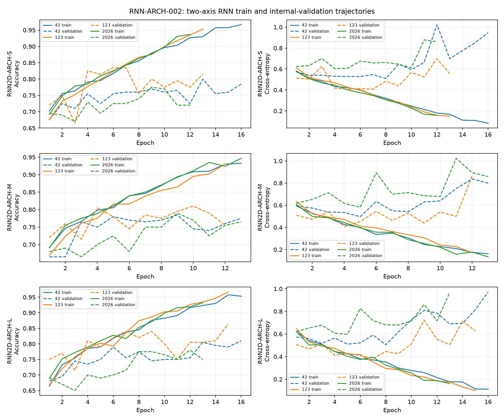

# RNN-ARCH-002：双轴标准 RNN 的视觉架构比较

仅使用 `data/train` 的种子 42、123、2026 三份既有 1800/200 划分，输入为冻结的 `REP-006-FUSION` `[190,7,7]`。各份归一化只拟合其训练图，无增强；没有使用 `data/val`。

每个模型先用共享的逐位置 Linear(190,C) 和 LayerNorm 投影 7×7 网格。每个 BiRNN2D 块对同一预归一化网格分别沿宽度与高度运行参数独立的双向 tanh `nn.RNN`，保留全部位置的输出；两个轴的结果拼接后经线性层融合并残差相加，再通过 Linear→ReLU→Linear 的通道 MLP 和第二次残差。最后对 49 个位置全局平均，再经 LayerNorm 和线性层输出两类 logits。S/M/L 只改变 C、每方向隐层及块数。

共同协议：CrossEntropyLoss、AdamW、学习率 3e-4、权重衰减 1e-4、批量 32、最多 40 轮、验证损失早停耐心 8、反传后梯度裁剪范数 1.0。检查点按最高验证准确率、同分较低损失选取。没有 Dropout、调度器或测试时增强。

## 三种规模的内部验证

标准差为三种子样本标准差。

| 规模 | C / 隐层 / 块数 | 参数量 | 平均准确率 ± 标准差 | 最差种子 | 猫/狗均值 | 类别差 | 平衡准确率 | Macro F1 | 最佳轮中位数 | 平均训练秒数 |
|---|---|---:|---:|---:|---:|---:|---:|---:|---:|---:|
| RNN2D-ARCH-S | 192 / 48 / 2 | 502,466 | 80.33% ± 3.01% | 77.50% | 89.00%/71.67% | 17.33 pp | 80.33% | 80.18% | 9 | 15.67 |
| RNN2D-ARCH-M | 256 / 64 / 3 | 1,286,914 | 79.50% ± 1.32% | 78.50% | 87.00%/72.00% | 15.00 pp | 79.50% | 79.36% | 9 | 20.59 |
| RNN2D-ARCH-L | 320 / 80 / 3 | 1,992,642 | 81.83% ± 4.31% | 78.00% | 87.00%/76.67% | 10.33 pp | 81.83% | 81.77% | 15 | 23.64 |

## 逐种子训练轨迹

| 架构 | 种子 | 最佳轮/末轮 | 最佳验证准确率 | 末轮训练/验证准确率 | 最佳轮→末轮验证损失 |
|---|---:|---:|---:|---:|---:|
| RNN2D-ARCH-S | 42 | 13/16 | 80.00% | 96.67%/78.50% | 0.6984→0.9461 |
| RNN2D-ARCH-S | 123 | 7/13 | 83.50% | 95.28%/81.50% | 0.4079→0.5541 |
| RNN2D-ARCH-S | 2026 | 9/12 | 77.50% | 93.67%/72.00% | 0.6457→0.8603 |
| RNN2D-ARCH-M | 42 | 9/13 | 78.50% | 93.28%/77.50% | 0.6293→0.7994 |
| RNN2D-ARCH-M | 123 | 10/12 | 81.00% | 93.06%/75.50% | 0.5390→0.8644 |
| RNN2D-ARCH-M | 2026 | 9/13 | 79.00% | 94.67%/76.50% | 0.6857→0.8582 |
| RNN2D-ARCH-L | 42 | 16/16 | 81.00% | 95.33%/81.00% | 0.9709→0.9709 |
| RNN2D-ARCH-L | 123 | 15/15 | 86.50% | 96.67%/86.50% | 0.6266→0.6266 |
| RNN2D-ARCH-L | 2026 | 12/13 | 78.00% | 93.22%/75.00% | 0.7166→0.9670 |

| 架构 | 末轮训练准确率均值 | 末轮验证准确率均值 | 末轮差距 | 最低验证损失后上升 ≥0.10 的运行数 |
|---|---:|---:|---:|---:|
| RNN2D-ARCH-S | 95.20% | 77.33% | 17.87 pp | 3/3 |
| RNN2D-ARCH-M | 93.67% | 76.50% | 17.17 pp | 3/3 |
| RNN2D-ARCH-L | 95.07% | 80.83% | 14.24 pp | 3/3 |

## 选择、容量与历史参照

按预设规则选定 **RNN2D-ARCH-L**（`mean_accuracy_gap_at_least_0.75_pp`）；前两名平均准确率差 1.50 个百分点。

S→M：平均准确率变化 -0.83 pp；M→L：+2.33 pp。S 并未表现出明显欠拟合：末轮训练准确率均值为 95.20%，但末轮验证仅 77.33%。M 增加容量后均值反而下降；L 的均值及狗类准确率提高，但三种子标准差扩大到 4.31%。三规模的验证损失后期均有回升，显示过拟合和种子敏感性仍然存在。

相对简单 RNN 的 B：入选模型平均准确率变化 +5.83 pp、最差种子变化 +4.50 pp；相对简单 RNN 的 C：分别变化 +6.17 pp 和 +3.00 pp。

内部开发参照：DNN-ARCH-C 78.17%、CNN-ARCH-C 79.83%、CNN-TRAIN-T1-FLIP 80.50%。这些训练协议不同，参照不参与 Stage II 选型，也不使用保留集结果。

## 下一步判定：Category A

两项竞争力门槛均满足；建议另立有限的 RNN 训练策略阶段。

本阶段没有运行 RNN 最终训练、训练策略搜索、高分辨率表示实验或 `data/val` 评估。
