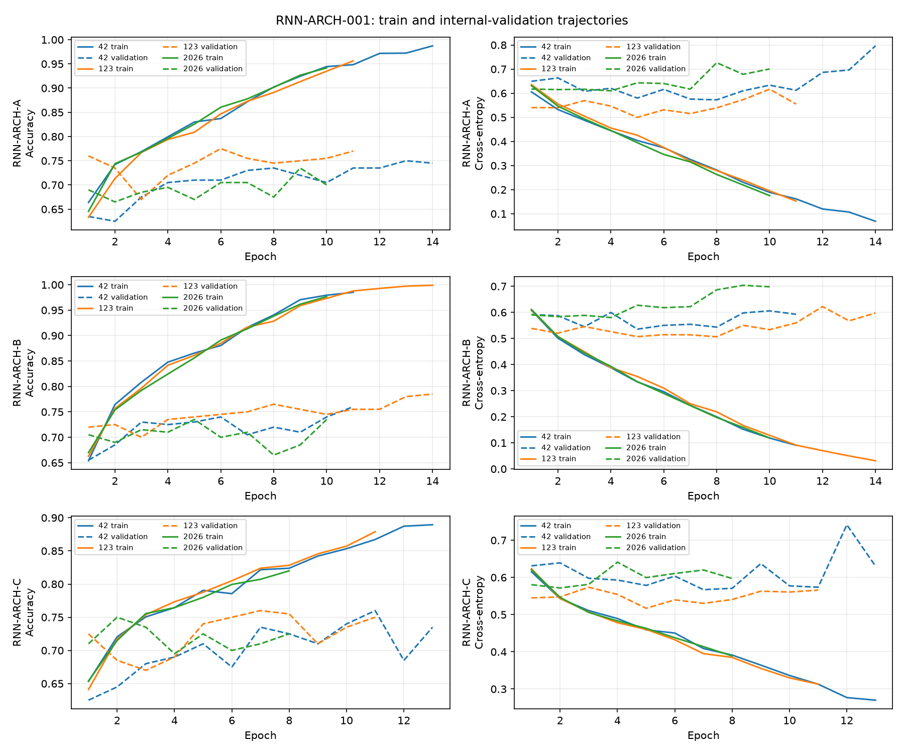

# RNN-ARCH-001：标准 RNN 架构选择

仅使用 `data/train` 的种子 42、123、2026 三份既有 1800/200 划分；输入是冻结的 `REP-006-FUSION` `[190,7,7]`，逐划分归一化只拟合 1800 张训练图，无增强。没有访问 `data/val`。

A/B 使用从上到下 7 行序列 `[B,7,1330]`；C 使用 7×7 栅格顺序的 49 单元序列 `[B,49,190]`。A 是单向 tanh RNN(128)，B 是双向 tanh RNN(96)，C 是双向 tanh RNN(128)。均为单层 `nn.RNN(batch_first=True)`，取 `h_n` 的末端方向状态，直接用线性层输出两类 logits。

固定 CrossEntropyLoss、AdamW、学习率 3e-4、权重衰减 1e-4、批量 32、最多 30 轮、验证损失早停耐心 6。所有运行在反向传播后、优化器更新前使用梯度裁剪范数 1.0；无 Dropout 或学习率调度器。检查点按最高验证准确率、同分较低验证损失选取。

## 三架构汇总

标准差为三种子的样本标准差。

| 架构 | 参数量 | 验证准确率均值 ± 标准差 | 最差种子 | 猫/狗均值 | 类别差 | Macro F1 | 最佳轮中位数 | 平均训练秒数 |
|---|---:|---:|---:|---:|---:|---:|---:|
| RNN-ARCH-A | 187,138 | 75.33% ± 2.02% | 73.50% | 81.67%/69.00% | 12.67 pp | 75.20% | 9 | 4.51 |
| RNN-ARCH-B | 274,562 | 76.00% ± 2.50% | 73.50% | 72.33%/79.67% | 7.33 pp | 75.77% | 11 | 5.38 |
| RNN-ARCH-C | 82,434 | 75.67% ± 0.58% | 75.00% | 80.67%/70.67% | 10.00 pp | 75.58% | 7 | 4.96 |

## 逐种子曲线诊断

| 架构 | 种子 | 最佳轮/末轮 | 最佳轮验证准确率 | 末轮训练准确率 | 最佳轮→末轮验证损失 |
|---|---:|---:|---:|---:|---:|
| RNN-ARCH-A | 42 | 13/14 | 75.00% | 98.72% | 0.6963→0.7964 |
| RNN-ARCH-A | 123 | 6/11 | 77.50% | 95.61% | 0.5313→0.5550 |
| RNN-ARCH-A | 2026 | 9/10 | 73.50% | 94.17% | 0.6784→0.7006 |
| RNN-ARCH-B | 42 | 11/11 | 76.00% | 98.50% | 0.5928→0.5928 |
| RNN-ARCH-B | 123 | 14/14 | 78.50% | 99.89% | 0.5978→0.5978 |
| RNN-ARCH-B | 2026 | 5/10 | 73.50% | 97.67% | 0.6274→0.6982 |
| RNN-ARCH-C | 42 | 11/13 | 76.00% | 88.94% | 0.5737→0.6305 |
| RNN-ARCH-C | 123 | 7/11 | 76.00% | 87.89% | 0.5304→0.5658 |
| RNN-ARCH-C | 2026 | 2/8 | 75.00% | 82.00% | 0.5716→0.5972 |

| 架构 | 末轮训练准确率均值 | 末轮验证准确率均值 | 末轮训练/验证差距 | 最低验证损失后升高 ≥ 0.10 的运行数 |
|---|---:|---:|---:|---:|
| RNN-ARCH-A | 96.17% | 73.83% | 22.33 pp | 1/3 |
| RNN-ARCH-B | 98.69% | 76.00% | 22.69 pp | 1/3 |
| RNN-ARCH-C | 86.28% | 73.67% | 12.61 pp | 0/3 |

A/B 的末轮训练准确率明显高于内部验证；C 的差距较小，但三个种子的训练准确率仍持续升高。验证损失在部分运行中回升，说明值得另立训练策略阶段检验正则化或增强；本阶段不执行该搜索。

## 预设规则与参照

按预设规则选定 **RNN-ARCH-C**；规则代码 `worst_seed_gap_at_least_1.0_pp`，前两名平均准确率相差 0.33 个百分点。

A→B（同为行序列）均值变化 +0.67 pp、最差种子变化 +0.00 pp、类别差变化 -5.33 pp。B→C（双向 RNN，7 行变 49 单元）均值变化 -0.33 pp、最差种子变化 +1.50 pp、类别差变化 +2.67 pp。

同一内部开发数据上的描述性参照：DNN-ARCH-C 78.17%，CNN-ARCH-C 79.83%，CNN-TRAIN-T1-FLIP 80.50%。训练设置不同，且这些参照不参与 RNN 选择；不使用已公布的保留集结果。

本阶段仅选择 RNN 架构。是否另立训练策略实验由实际曲线诊断决定；未进行全量 RNN 训练或保留集评估。
