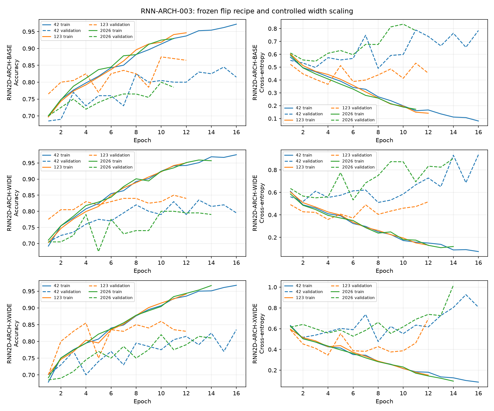

# RNN-ARCH-003：冻结镜像配方的最终宽度比较

固定 `REP-006-FUSION` `[190,7,7]`、三份既有 1800/200 内部划分和 `RNN-TRAIN-T1-FLIP` 配方。每份训练集为 1800 原图 + 1800 张 RGB 水平镜像后重提的特征；190 通道归一化只由这 3600 张训练图拟合。固定 AdamW、学习率 `3e-4`、权重衰减 `1e-4`、批量 32、最多 40 轮、验证损失早停耐心 8、梯度裁剪 1.0，无 Dropout 或调度器。BASE 直接导入 T1 三种子记录，未重训；仅新增 WIDE/XWIDE 各三次正式运行，没有访问 `data/val`。

三个模型均使用逐位置 Linear 投影、三个双轴双向 tanh `nn.RNN` 残差块、相同的 2 倍通道 MLP 和 49 位置平均池化。只变动嵌入宽度 C 与每方向隐层 H，始终 H=C/4。

## 三种子内部验证

标准差为三种子的样本标准差；增益相对 BASE，单位为百分点。

| 架构 | C/H/块 | 参数量 | 参数倍率 | 准确率均值 ± 标准差 | 种子 42/123/2026 | 最差/最好 | 猫/狗均值 | Macro F1 | 最佳轮中位数 | 均值/最差增益及标准差变化 | 资格 |
|---|---|---:|---:|---:|---:|---:|---:|---:|---:|---:|---|
| RNN2D-ARCH-BASE | 320/80/3 | 1,992,642 | 1.00× | 84.00% ± 3.77% | 84.50%/87.50%/80.00% | 80.00%/87.50% | 85.33%/82.67% | 83.98% | 10 | +0.00/+0.00/+0.00 | historical baseline |
| RNN2D-ARCH-WIDE | 384/96/3 | 2,851,970 | 1.43× | 82.83% ± 2.57% | 83.50%/85.00%/80.00% | 80.00%/85.00% | 82.00%/83.67% | 82.82% | 11 | -1.17/+0.00/-1.21 | no_meaningful_gain |
| RNN2D-ARCH-XWIDE | 448/112/3 | 3,864,898 | 1.94× | 83.83% ± 2.02% | 83.50%/86.00%/82.00% | 82.00%/86.00% | 85.33%/82.33% | 83.83% | 10 | -0.17/+2.00/-1.75 | no_meaningful_gain |

## 容量与过拟合

| 架构 | 末轮训练均值 | 末轮验证均值 | 训练/验证差距 | 后期验证损失回升 ≥0.10 | 平均训练秒数 |
|---|---:|---:|---:|---:|---:|
| RNN2D-ARCH-BASE | 94.92% | 82.17% | 12.75 pp | 3/3 | 41.73 |
| RNN2D-ARCH-WIDE | 96.09% | 80.83% | 15.26 pp | 3/3 | 45.47 |
| RNN2D-ARCH-XWIDE | 95.85% | 82.50% | 13.35 pp | 3/3 | 51.45 |

| 架构 | 种子 | 最佳/末轮 | 最佳轮训练准确率 | 末轮训练/验证准确率 | 最佳验证准确率 | 后期损失回升 |
|---|---:|---:|---:|---:|---:|---:|
| RNN2D-ARCH-BASE | 42 | 15/16 | 96.19% | 97.19%/81.50% | 84.50% | 是 |
| RNN2D-ARCH-BASE | 123 | 10/12 | 91.83% | 94.64%/86.50% | 87.50% | 是 |
| RNN2D-ARCH-BASE | 2026 | 10/11 | 92.47% | 92.92%/78.50% | 80.00% | 是 |
| RNN2D-ARCH-WIDE | 42 | 13/16 | 95.08% | 97.56%/79.50% | 83.50% | 是 |
| RNN2D-ARCH-WIDE | 123 | 11/12 | 94.19% | 95.03%/84.00% | 85.00% | 是 |
| RNN2D-ARCH-WIDE | 2026 | 11/14 | 93.47% | 95.69%/79.00% | 80.00% | 是 |
| RNN2D-ARCH-XWIDE | 42 | 16/16 | 96.75% | 96.75%/83.50% | 83.50% | 是 |
| RNN2D-ARCH-XWIDE | 123 | 10/12 | 91.44% | 94.14%/83.00% | 86.00% | 是 |
| RNN2D-ARCH-XWIDE | 2026 | 10/14 | 90.42% | 96.67%/81.00% | 82.00% | 是 |

## 缩放判断与冻结结论

BASE→WIDE：均值变化 -1.17 pp，最差种子变化 +0.00 pp，猫狗差变化 -1.00 pp，标准差变化 -1.21 pp。

WIDE→XWIDE：均值变化 +1.00 pp，最差种子变化 +2.00 pp，猫狗差变化 +1.33 pp，标准差变化 -0.55 pp。

BASE、WIDE、XWIDE 的最佳轮中位数分别为 10/11/10，没有随宽度增大而明显提前。末轮训练准确率均值分别为 94.92%/96.09%/95.85%；WIDE 和 XWIDE 的训练/验证差距相对 BASE 分别变化 +2.51/+0.60 pp。三个架构均有 3/3 次后期验证损失回升。XWIDE 的最差种子与标准差改善，但平均准确率仍低于 BASE，因此没有形成可复现的正向均值缩放收益。

根据预设均值、最差种子与方差保护规则，缩放行为判为 **saturation**；选择 **RNN2D-ARCH-BASE**（`no_meaningful_width_gain`），Outcome **B**。

架构优化到此结束。下一步是独立的 RNN 训练设置优化阶段；本任务没有进一步加宽、改深、调参、全量训练或评估 `data/val`。
