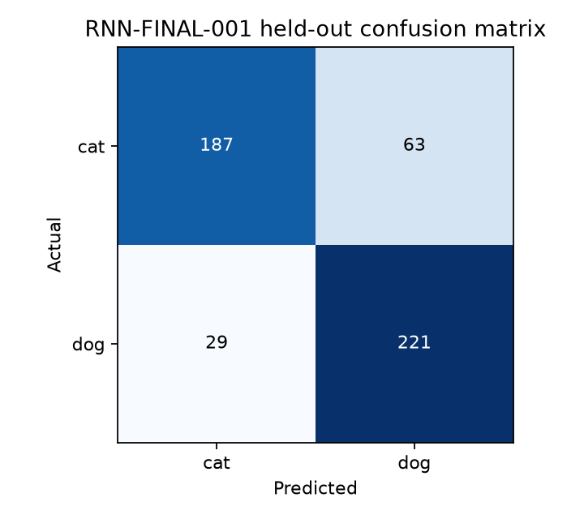

# RNN-FINAL-001：最终 RNN 实验

## 1. 冻结流程

RGB 原图 → 保长宽比缩放及反射填充至 128×128 → HOG + LBP + HSV + RootSIFT → REP-006 `[190,7,7]` → 逐位置 `Linear(190,320)` 与 LayerNorm → 三块双轴双向 tanh `nn.RNN` 残差块 → 7×7 位置全局均值池化 → `Linear(320,2)` 猫狗分类。每块沿水平和垂直轴使用独立的双向 RNN，保留所有时刻输出；不含卷积、注意力、LSTM、GRU 或 Dropout。

## 2. 架构与策略选择依据

简单一维 RNN 开发阶段的最佳三种子均值为 75.67%；双轴 RNN2D 的 L 为 81.83%。加入原图 RGB 水平镜像训练后，冻结 BASE 的内部验证均值为 84.00%。随后加宽和学习率调度没有达到预设改进门槛，因此保留 BASE 与恒定 `3e-4`。最终 10 轮数取自三种子共同轮次曲线，而非本次留出集。

## 3. 最终训练

全部 2000 张训练原图及 2000 张 RGB 水平镜像图构成 4000 张特征图（猫、狗各 2000）；仅用它们拟合 190 通道归一化。新模型从头初始化，种子 42；AdamW，恒定学习率 `3e-4`，权重衰减 `1e-4`，批量 32，梯度范数裁剪 1.0，交叉熵，恰好 10 轮；无验证、早停或调度器。模型参数 1,992,642，训练耗时 269.07 秒，第 10 轮训练损失 0.1823，准确率 92.80%（猫 93.10%，狗 92.50%）。仅保存第 10 轮状态，SHA-256：`625b98cd4bd3616dd200506ebde2a3135c0fe197d1d9ac15b7b77929e1aac442`。

## 4. 一次留出集评估

从磁盘重载第 10 轮检查点，用训练集归一化对 `data/val` 的 500 张原图各推理一次。交叉熵损失 **0.6695**；总体准确率 **81.60%**；猫 **74.80%**；狗 **88.40%**；平衡准确率 **81.60%**；Macro F1 **81.51%**。混淆矩阵行是真实猫/狗、列是预测猫/狗：`[[187, 63], [29, 221]]`。

## 5. DNN / CNN / RNN 最终结果对照

| 模型 | 参数量 | 总体准确率 | 猫准确率 | 狗准确率 | 平衡准确率 | Macro F1 |
|---|---:|---:|---:|---:|---:|---:|
| DNN-FINAL-001 | 2,417,538 | 73.80% | 65.60% | 82.00% | 73.80% | 73.62% |
| CNN-FINAL-001 | 89,794 | 81.20% | 81.20% | 81.20% | 81.20% | 81.20% |
| RNN-FINAL-001 | 1,992,642 | 81.60% | 74.80% | 88.40% | 81.60% | 81.51% |

三者均使用 REP-006，但 DNN 最终训练未使用 CNN/RNN 的镜像增强，最终训练轮数与优化动态也不同；这些数字描述实际结果，不能把差距单独归因于网络结构。500 张留出图此前已用于项目 DNN 和 CNN 的最终评估，因此不是全项目意义上的首次未见数据；它没有参与 RNN 的架构、正则化、宽度或学习率选择。RNN 流程在本次评估前已冻结，结果出现后没有再调参或重训。

逐轮训练见 [train_history.csv](train_history.csv)，单张预测见 [predictions.csv](predictions.csv)，机器指标见 [test_metrics.json](test_metrics.json)。
