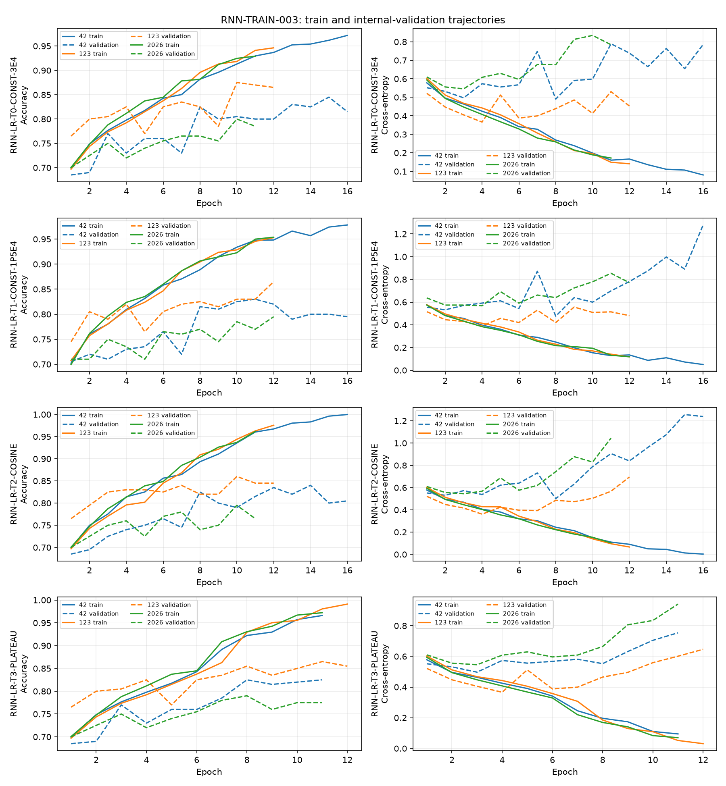

# RNN-TRAIN-003：冻结双轴 RNN 学习率策略实验

仅用原训练集的三份 1800/200 内部划分；`data/val` 未用于本阶段。架构固定为 `RNN2D-ARCH-BASE`（代码标识 `RNN2D-ARCH-L`），1,992,642 参数；REP-006 `[190,7,7]`，原图和 RGB 水平镜像特征共 3600 张参与训练归一化。T0 从既有 Flip-only 记录导入，未重训。

## 三种子结果

百分比标准差为样本标准差；变化均相对 T0，单位为百分点。

| 策略 | 均值 ± 标准差 | 42 / 123 / 2026 | 最差 / 最好 | 猫 / 狗均值 | Macro F1 | 最佳轮中位数 | 末轮训练/验证差 | 晚期损失反弹次数 | 均值/最差/标准差变化 |
|---|---:|---:|---:|---:|---:|---:|---:|---:|---:|
| RNN-LR-T0-CONST-3E4 | 84.00% ± 3.77% | 84.50% / 87.50% / 80.00% | 80.00% / 87.50% | 85.33% / 82.67% | 83.98% | 10 | 12.75 pp | 3/3 | +0.00/+0.00/+0.00 |
| RNN-LR-T1-CONST-1P5E4 | 83.00% ± 3.50% | 83.00% / 86.50% / 79.50% | 79.50% / 86.50% | 85.67% / 80.33% | 82.92% | 12 | 14.34 pp | 3/3 | -1.00/-0.50/-0.27 |
| RNN-LR-T2-COSINE | 83.17% ± 3.33% | 84.00% / 86.00% / 79.50% | 79.50% / 86.00% | 87.67% / 78.67% | 83.13% | 10 | 17.39 pp | 3/3 | -0.83/-0.50/-0.45 |
| RNN-LR-T3-PLATEAU | 82.67% ± 3.75% | 82.50% / 86.50% / 79.00% | 79.00% / 86.50% | 83.33% / 82.00% | 82.66% | 8 | 15.81 pp | 3/3 | -1.33/-1.00/-0.02 |

## 收敛与调度器诊断

下表中的损失反弹为最低验证损失之后的最大增加；最佳准确率轮次沿用检查点选择规则。

| 策略 | 种子 | 最佳/末轮 | 最低损失轮 | 最佳轮学习率 | 末轮学习率 | 损失反弹 | 降率轮次 | 最佳准确率相对首次降率 |
|---|---:|---:|---:|---:|---:|---:|---|---|
| RNN-LR-T0-CONST-3E4 | 42 | 15/16 | 8 | 0.0003 | 0.0003 | 0.299 | — | — |
| RNN-LR-T0-CONST-3E4 | 123 | 10/12 | 4 | 0.0003 | 0.0003 | 0.165 | — | — |
| RNN-LR-T0-CONST-3E4 | 2026 | 10/11 | 3 | 0.0003 | 0.0003 | 0.289 | — | — |
| RNN-LR-T1-CONST-1P5E4 | 42 | 11/16 | 8 | 0.00015 | 0.00015 | 0.803 | — | — |
| RNN-LR-T1-CONST-1P5E4 | 123 | 12/12 | 4 | 0.00015 | 0.00015 | 0.165 | — | — |
| RNN-LR-T1-CONST-1P5E4 | 2026 | 12/12 | 4 | 0.00015 | 0.00015 | 0.286 | — | — |
| RNN-LR-T2-COSINE | 42 | 14/16 | 8 | 8.9171378e-05 | 3.7692536e-05 | 0.756 | — | — |
| RNN-LR-T2-COSINE | 123 | 10/12 | 4 | 0.000177683 | 0.00011019254 | 0.334 | — | — |
| RNN-LR-T2-COSINE | 2026 | 10/11 | 3 | 0.000177683 | 0.000132317 | 0.500 | — | — |
| RNN-LR-T3-PLATEAU | 42 | 8/11 | 3 | 9e-05 | 2.7e-05 | 0.257 | 6, 9 | 降率后 |
| RNN-LR-T3-PLATEAU | 123 | 11/12 | 4 | 2.7e-05 | 2.7e-05 | 0.280 | 7, 10 | 降率后 |
| RNN-LR-T3-PLATEAU | 2026 | 8/11 | 3 | 9e-05 | 2.7e-05 | 0.395 | 6, 9 | 降率后 |

T2 在每轮训练完成后步进余弦调度器；表中最佳轮学习率是该轮实际用于训练的值。T3 在每次验证后按验证损失步进；降率轮次表示该轮验证之后改变了下一轮学习率。

与 T0 相比，T1/T2/T3 的晚期损失反弹次数分别为 3/3、3/3、3/3；T0 为 3/3。反弹次数只描述是否越过 0.10，不代表整体泛化质量。

- 种子 42：T2 最低实际训练学习率 5.2469517e-05，未达到 eta_min；T3 降率 2 次，首次降率轮次 6，最佳准确率在首次降率之后。
- 种子 123：T2 最低实际训练学习率 0.000132317，未达到 eta_min；T3 降率 2 次，首次降率轮次 7，最佳准确率在首次降率之后。
- 种子 2026：T2 最低实际训练学习率 0.000155，未达到 eta_min；T3 降率 2 次，首次降率轮次 6，最佳准确率在首次降率之后。

三个新策略均为 3/3 次达到至少 0.10 的晚期验证损失反弹；T1/T2 的反弹幅度没有系统减小，T3 仅在种子 42 上略低于 T0，其他两种子更高。T2 的三个最佳轮都已使用低于初始值的学习率，因此衰减影响了训练，但未改善均值；T3 的三个最佳轮都发生在首次降率后，但均值仍低于 T0。

## 选择与后续

预设门槛与并列规则选定 **RNN-LR-T0-CONST-3E4**（`no_new_strategy_qualified`；无新策略达标）。相对 T0：均值 +0.00 pp，最差种子 +0.00 pp，标准差 +0.00 pp。

选定策略的三种子共同轮次诊断见 [selected_policy_matched_epochs.csv](selected_policy_matched_epochs.csv)。该表逐轮列出平均验证准确率、样本标准差、平均验证损失及猫/狗准确率；本阶段不从中直接指定最终轮次。下一阶段应据既有曲线确定固定最终轮次，再另立 `RNN-FINAL-001`。

本阶段未做最终全数据训练，也未产生 RNN 留出测试集结果。

### 选定策略的共同轮次诊断

| 轮次 | 平均验证准确率 | 样本标准差 | 平均验证损失 | 猫准确率 | 狗准确率 |
|---:|---:|---:|---:|---:|---:|
| 1 | 71.67% | 4.25% | 0.5612 | 78.00% | 65.33% |
| 2 | 73.83% | 5.62% | 0.5117 | 69.00% | 78.67% |
| 3 | 77.50% | 2.78% | 0.4827 | 81.33% | 73.67% |
| 4 | 75.83% | 5.80% | 0.5159 | 81.00% | 70.67% |
| 5 | 75.67% | 1.53% | 0.5658 | 72.33% | 79.00% |
| 6 | 78.00% | 3.91% | 0.5173 | 76.00% | 80.00% |
| 7 | 77.67% | 5.35% | 0.6083 | 67.33% | 88.00% |
| 8 | 80.50% | 3.46% | 0.5352 | 86.33% | 74.67% |
| 9 | 78.00% | 2.29% | 0.6297 | 80.33% | 75.67% |
| 10 | 82.67% | 4.19% | 0.6153 | 82.00% | 83.33% |
| 11 | 81.83% | 4.54% | 0.7013 | 84.00% | 79.67% |
