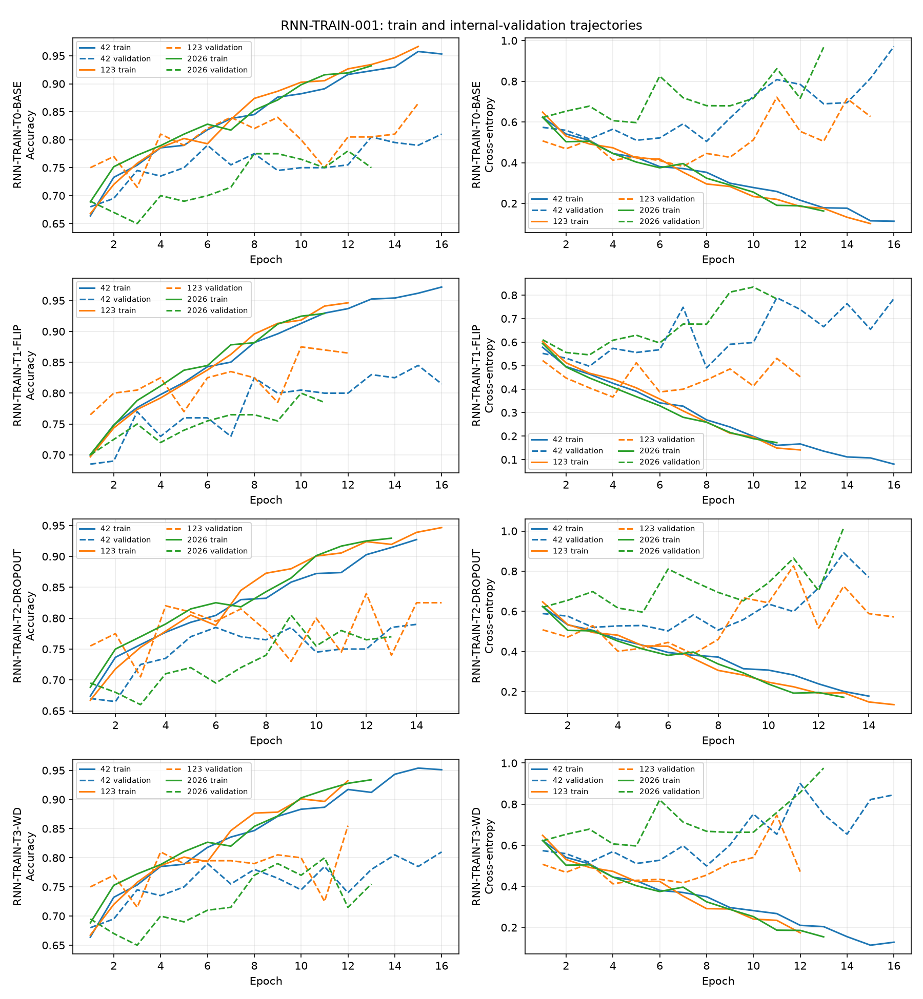

# RNN-TRAIN-001：双轴 RNN 的有限训练正则化比较

固定 `RNN2D-ARCH-L`（1,992,642 参数）与 `REP-006-FUSION` `[190,7,7]`。沿用种子 42、123、2026 的三份 1800/200 内部划分，只用训练索引拟合归一化；没有访问 `data/val`。T0 直接导入 RNN-ARCH-002 三次记录，没有重训。

T1 使用 RGB 水平翻转后重新提取的既有 REP-006 缓存，每份训练集为 1800 原图 + 1800 镜像图，归一化仅由这 3600 张图拟合；验证仍为 200 张原图。T2 只在每块的轴融合线性层后、MLP ReLU 后和 MLP 第二线性层后使用 `nn.Dropout(0.10)`。T3 只将 AdamW 权重衰减从 `1e-4` 提高至 `5e-4`。三者共用学习率 `3e-4`、批量 32、最多 40 轮、早停耐心 8、梯度裁剪 1.0；按最高内部验证准确率及同分较低损失保存检查点。

## 三种子结果

标准差为三种子的样本标准差；所有变化相对 T0，单位为百分点。

| 策略 | 参数量 | 训练样本 | 平均准确率 ± 标准差 | 种子 42/123/2026 | 最差/最好 | 猫/狗均值 | Macro F1 | 最佳轮中位数 | 平均训练秒数 | 均值/最差/标准差变化 | 改进级别 |
|---|---:|---:|---:|---:|---:|---:|---:|---:|---:|---:|---|
| RNN-TRAIN-T0-BASE | 1,992,642 | 1800 | 81.83% ± 4.31% | 81.00%/86.50%/78.00% | 78.00%/86.50% | 87.00%/76.67% | 81.77% | 15 | 23.64 | +0.00/+0.00/+0.00 | baseline |
| RNN-TRAIN-T1-FLIP | 1,992,642 | 3600 | 84.00% ± 3.77% | 84.50%/87.50%/80.00% | 80.00%/87.50% | 85.33%/82.67% | 83.98% | 10 | 41.73 | +2.17/+2.00/-0.54 | strong |
| RNN-TRAIN-T2-DROPOUT | 1,992,642 | 1800 | 81.17% ± 2.57% | 79.00%/84.00%/80.50% | 79.00%/84.00% | 83.33%/79.00% | 81.15% | 12 | 23.54 | -0.67/+1.00/-1.75 | weak_or_none |
| RNN-TRAIN-T3-WD | 1,992,642 | 1800 | 82.17% ± 2.93% | 81.00%/85.50%/80.00% | 80.00%/85.50% | 84.33%/80.00% | 82.13% | 12 | 22.40 | +0.33/+2.00/-1.38 | stability |

## 过拟合诊断

| 策略 | 末轮训练均值 | 末轮验证均值 | 平均差距 | 最低验证损失后升高 ≥0.10 的运行数 | 猫狗准确率差 |
|---|---:|---:|---:|---:|---:|
| RNN-TRAIN-T0-BASE | 95.07% | 80.83% | 14.24 pp | 3/3 | 10.33 pp |
| RNN-TRAIN-T1-FLIP | 94.92% | 82.17% | 12.75 pp | 3/3 | 2.67 pp |
| RNN-TRAIN-T2-DROPOUT | 93.44% | 79.50% | 13.94 pp | 3/3 | 4.33 pp |
| RNN-TRAIN-T3-WD | 93.91% | 80.67% | 13.24 pp | 3/3 | 4.33 pp |

T1 相对 T0 的末轮训练/验证差距缩小 1.49 pp，猫狗准确率差缩小 7.67 pp；其三种子标准差下降 0.54 pp。T1 的训练样本数翻倍，收益应归为数据增强与有效样本扩充。

T2 的均值相对 T0 变化 -0.67 pp，虽然标准差下降，未达到预设改进门槛。T3 的均值变化 +0.33 pp、最差种子改善 +2.00 pp、标准差下降 1.38 pp，因此达到稳定性改进门槛。各策略至少有 3/3 次后期验证损失回升，过拟合尚未消除。

## 选择和下一步

按冻结的均值优先、近差距重视最差种子的规则，选择 **RNN-TRAIN-T1-FLIP**（`highest_mean_accuracy`）。组合资格：**true**；候选：RNN-TRAIN-T1-FLIP, RNN-TRAIN-T3-WD。

结论为 **Outcome A**。另立 RNN-ARCH-003 受控架构扩展；本阶段不启动。

历史描述性参照（内部验证均值）：RNN-ARCH-B 76.00%、RNN-ARCH-C 75.67%、RNN2D-ARCH-S 80.33%、RNN2D-ARCH-M 79.50%、RNN2D-ARCH-L 81.83%、CNN-TRAIN-T1-FLIP 80.50%。不同阶段的训练协议可能不同，这些参照不参与本阶段选型。

本阶段没有运行策略组合、RNN 最终训练、架构扩展、表示改造或 `data/val` 评估。
