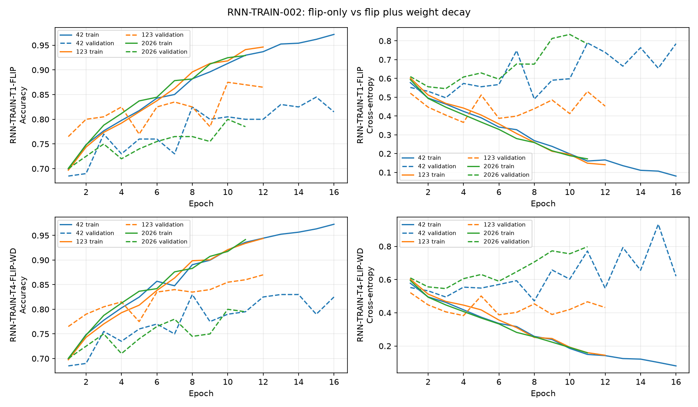

# RNN-TRAIN-002：镜像增强与更强权重衰减组合

冻结 `REP-006-FUSION` `[190,7,7]`、`RNN2D-ARCH-L` 与种子 42/123/2026 的原 1800/200 划分。每份训练集使用 1800 原图和 1800 张 RGB 水平镜像后重提的特征，归一化仅由这 3600 张图拟合；验证始终为 200 张原图。T4 相对 T1 只将 AdamW 权重衰减由 `1e-4` 改为 `5e-4`，其余固定为学习率 `3e-4`、批量 32、最多 40 轮、早停耐心 8、梯度裁剪 1.0、无 Dropout 和调度器。没有使用 `data/val`。

## 与既有策略比较

标准差为三种子的样本标准差。T0/T1/T3 直接读取已归档记录，没有重训。

| 策略 | 均值 ± 标准差 | 种子 42/123/2026 | 最差/最好 | 猫/狗均值 | Macro F1 | 末轮训练/验证差距 | 后期损失回升 | 平均训练秒数 |
|---|---:|---:|---:|---:|---:|---:|---:|---:|
| RNN-TRAIN-T0-BASE | 81.83% ± 4.31% | 81.00%/86.50%/78.00% | 78.00%/86.50% | 87.00%/76.67% | 81.77% | 14.24 pp | 3/3 | 23.64 |
| RNN-TRAIN-T1-FLIP | 84.00% ± 3.77% | 84.50%/87.50%/80.00% | 80.00%/87.50% | 85.33%/82.67% | 83.98% | 12.75 pp | 3/3 | 41.73 |
| RNN-TRAIN-T3-WD | 82.17% ± 2.93% | 81.00%/85.50%/80.00% | 80.00%/85.50% | 84.33%/80.00% | 82.13% | 13.24 pp | 3/3 | 22.40 |
| RNN-TRAIN-T4-FLIP-WD | 83.33% ± 3.51% | 83.00%/87.00%/80.00% | 80.00%/87.00% | 83.67%/83.00% | 83.33% | 12.28 pp | 3/3 | 42.31 |

## T4 逐种子轨迹诊断

| 种子 | 最佳/末轮 | 最佳轮训练准确率 | 末轮训练准确率 | 最佳/末轮验证准确率 | 最佳准确率轮验证损失 | 最低验证损失 | 之后回升 ≥0.10 |
|---:|---:|---:|---:|---:|---:|---:|---:|
| 42 | 8/16 | 89.06% | 97.28% | 83.00%/82.50% | 0.4716 | 0.4716 | 是 |
| 123 | 12/12 | 94.39% | 94.39% | 87.00%/87.00% | 0.4319 | 0.3830 | 是 |
| 2026 | 10/11 | 91.75% | 94.17% | 80.00%/79.50% | 0.7551 | 0.5455 | 是 |

## 冻结决策

相对 T1：平均准确率变化 -0.67 pp，最差种子变化 +0.00 pp，最好种子变化 -0.50 pp，样本标准差变化 -0.26 pp，猫狗准确率差变化 -2.00 pp，末轮训练/验证差距变化 -0.47 pp。

T4 的平均准确率下降，最差种子未改善；种子标准差下降。猫狗准确率差从 2.67 pp 变为 0.67 pp，类别平衡得以保持。末轮训练/验证差距仅变化 -0.47 pp，且 T1 与 T4 的后期验证损失回升分别为 3/3 和 3/3；没有证据表明更强权重衰减实质消除了过拟合。

按预设规则选择 **RNN-TRAIN-T1-FLIP**（`combination_did_not_meet_predeclared_threshold`）。冻结未来架构比较的配方为 RGB 水平镜像增强、学习率 `3e-4`、AdamW 权重衰减 `0.0001`、无 Dropout。下一阶段可另立 `RNN-ARCH-003` 受控宽度扩展；本任务没有启动。

本阶段仅新增 T4 三个种子的训练；没有访问 `data/val`、运行 RNN 最终训练、额外策略或架构扩展。
